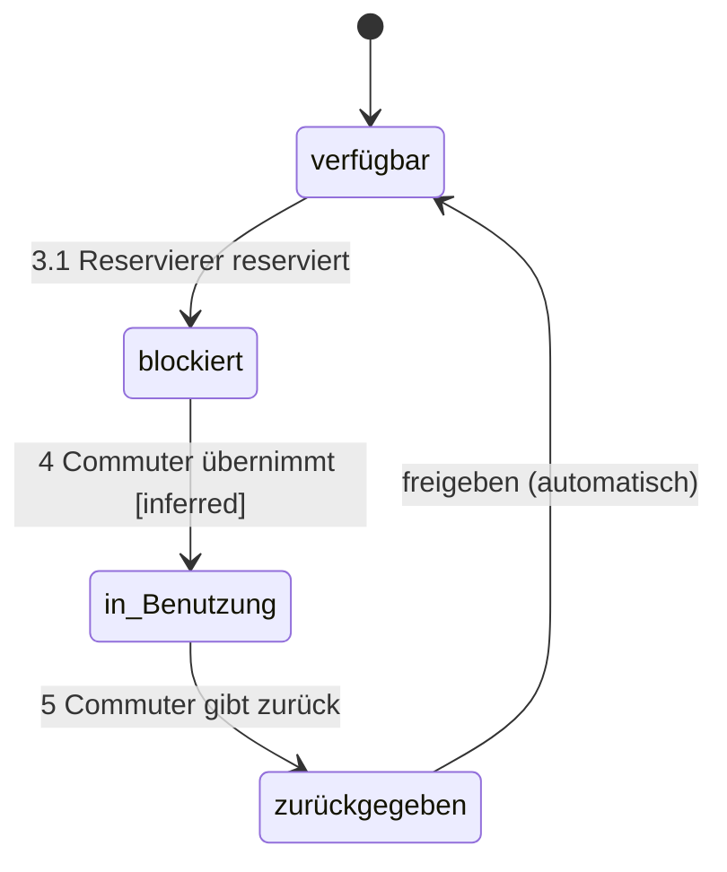

# Prototype Brief — Fahrrad-Sharing

## 1. Story-Transkription

Keine Lanes/Gruppen — eine einzige Domäne.

| Nr. | Satz |
|-----|------|
| 1 | Commuter öffnet APP und bucht Subscription |
| 2 | Customer Care sendet Bestätigung an APP |
| 3 | Commuter sucht & wählt aus verfügbares Fahrrad — löst aus → Reservierer |
| 3.1 | Reservierer reserviert blockiertes Fahrrad |
| 4 | Commuter übernimmt blockiertes Fahrrad |
| 5 | Commuter gibt zurück zurückgebenes Fahrrad in Rack mit Standort → freigeben → verfügbares Fahrrad |

---

## 2. Akteure & Rollen

| Akteur | Typ | Rolle |
|--------|-----|-------|
| **Commuter** | Person | Endnutzer; bucht, fährt, gibt zurück |
| **Customer Care** | Person | Support-Rolle; sendet Bestätigung manuell oder stellvertretend |
| **Reservierer** | Software-System | Automatisiertes Buchungssystem; blockiert Fahrräder auf Auslösung |

Keine Rollentransition — der Commuter bleibt durchgehend Commuter.

---

## 3. Module (Bounded Contexts)

Keine Lanes im Diagramm → ein Modul. Implizit lassen sich zwei Subdomänen erkennen:

| Modul | Inhalte |
|-------|---------|
| **Onboarding / Subscription** | Schritte 1–2: App öffnen, Subscription buchen, Bestätigung empfangen |
| **Bike Lifecycle** | Schritte 3–5: Fahrrad suchen, reservieren, übernehmen, zurückgeben |

---

## 4. Domänenmodell

**Entitäten:**

| Entität | Inferred Attribute |
|---------|-------------------|
| **Subscription** | commuter_id, status (active/inactive), start_date, plan_type |
| **Bestätigung** | subscription_id, sent_at, recipient (commuter), channel (App) |
| **Fahrrad** | id, status (verfügbar / blockiert / zurückgegeben), rack_id |
| **Reservierung** | fahrrad_id, commuter_id, reserved_at, status |
| **Rack** | id, standort (Koordinaten/Adresse), kapazität |

**UI-Oberfläche:** APP (mobil)

**Physische/externe Objekte:** Rack mit Standort (reale Infrastruktur, als Datensatz referenziert)

---

## 5. State Machines

### Fahrrad-Lifecycle

| Von | Nach | Trigger | Akteur |
|-----|------|---------|--------|
| verfügbar | blockiert | Commuter wählt aus → löst Reservierer aus (3.1) | Reservierer (auto) |
| blockiert | in Benutzung | übernimmt (4) | Commuter |
| in Benutzung | zurückgegeben | gibt zurück in Rack (5) | Commuter |
| zurückgegeben | verfügbar | freigeben | System (automatisch) |

`in Benutzung` ist **inferred** — die Story zeigt keinen expliziten Zustand zwischen Übernahme und Rückgabe.

### Subscription

| Von | Nach | Trigger | Akteur |
|-----|------|---------|--------|
| — | gebucht | bucht via APP (1) | Commuter |
| gebucht | bestätigt | Bestätigung empfangen (2) | Customer Care |

---

## 6. Use Cases & User Journey

| Nr. | Rolle | Aktion | Entität | Kanal | Zustandsänderung |
|-----|-------|--------|---------|-------|-----------------|
| 1 | Commuter | öffnet + bucht | Subscription | APP | Subscription → gebucht |
| 2 | Customer Care | sendet Bestätigung | Bestätigung | APP | Subscription → bestätigt |
| 3 | Commuter | sucht & wählt aus | verfügbares Fahrrad | APP | löst Reservierer aus |
| 3.1 | Reservierer (auto) | reserviert | Fahrrad | — | verfügbar → blockiert |
| 4 | Commuter | übernimmt | blockiertes Fahrrad | physisch | blockiert → in Benutzung [inferred] |
| 5 | Commuter | gibt zurück | Fahrrad | physisch, Rack | zurückgegeben → verfügbar (freigeben auto) |

---

## 7. Screens & Navigation

### Onboarding / Subscription (Commuter)

| Screen | Zweck | Schlüsselelemente | Weiter zu |
|--------|-------|-------------------|-----------|
| **App-Start** | Einstieg | Öffnen-Button, Login | Subscription-Auswahl |
| **Subscription buchen** | Plan wählen & kaufen | Planauswahl, Bezahlung | Warte-/Bestätigungsscreen |
| **Bestätigung empfangen** | Erfolgsrückmeldung | Bestätigungstext, weiter | Fahrrad-Suche |

### Bike Lifecycle (Commuter)

| Screen | Zweck | Schlüsselelemente | Weiter zu |
|--------|-------|-------------------|-----------|
| **Fahrrad suchen** | Verfügbare Räder anzeigen | Karte/Liste mit verfügbaren Fahrrädern | Fahrrad-Detail |
| **Fahrrad auswählen** | Auswahl + Reservierungsauslösung | „Reservieren"-Button → triggert Reservierer | Übernahme-Screen |
| **Fahrrad übernehmen** | Entsperren / Übernahme bestätigen | QR-Code / PIN, Status: blockiert | Aktiv-Fahrt-Screen |
| **Fahrrad zurückgeben** | Rückgabe am Rack | Rack-Auswahl oder GPS-Confirm, „Zurückgeben"-Button | Abschluss-Screen |
| **Abschluss** | Rückgabe-Bestätigung | Fahrt-Zusammenfassung, Rack-Standort | Fahrrad-Suche / Home |

### Customer Care (intern)

| Screen | Zweck |
|--------|-------|
| **Bestätigung senden** | Subscription-Bestätigung manuell oder automatisch auslösen |

---

## 8. Offene Fragen & Annahmen

| # | Frage |
|---|-------|
| 1 | **Wer löst "freigeben" aus?** Automatisch durch das System bei Rückgabe ins Rack, oder manuell bestätigt? |
| 2 | **Wie genau übernimmt der Commuter das Fahrrad?** PIN, QR-Code, NFC? Die Story zeigt kein Entsperr-Objekt. |
| 3 | **Sendet Customer Care Bestätigungen manuell oder automatisch?** Der Story-Pfad legt manuell nahe, aber das ist für einen Prototyp unwahrscheinlich. |
| 4 | **Hat eine Subscription ein Ablaufdatum / Fahrtlimit?** Billing-Logik fehlt komplett. |
| 5 | **Kann ein Commuter mehrere Fahrräder gleichzeitig reservieren?** Multiplizität nicht gezeigt. |
| 6 | **Was passiert, wenn das gewählte Fahrrad zwischen Auswahl und Übernahme von jemand anderem genommen wird?** Kein Fehlerfall im Story. |
| 7 | **Rack mit Standort**: Kann der Commuter an einem beliebigen Rack zurückgeben, oder nur am Ursprungs-Rack? |
| 8 | **Auth/Account-Modell**: Gibt es einen Account vor der Subscription, oder entsteht der Account durch die Buchung? |
